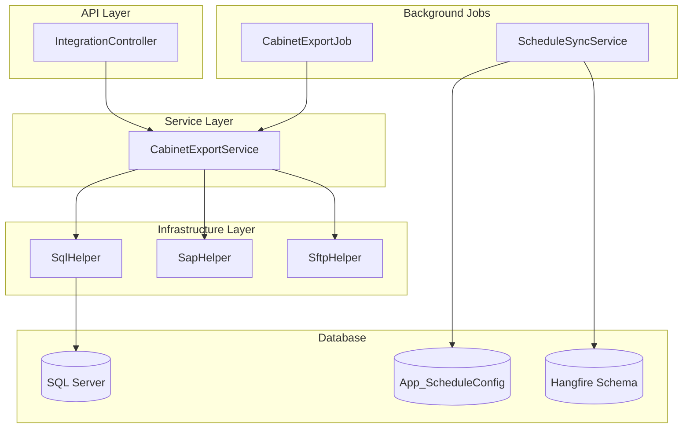

# SAP 整合中間件 API - 實作計畫 (v1.2 更新)

本次更新新增 **Hangfire 資料庫驅動排程功能**。

---

## User Review Required

> [!IMPORTANT]
> **Hangfire 需要額外的資料庫權限**
> - Hangfire 會在 SQL Server 自動建立 Schema (預設 `HangFire.*`)
> - 連線帳號需要 `CREATE TABLE` 權限

> [!WARNING]
> **IIS 必須設定 AlwaysRunning**
> - 若未設定，IIS 閒置休眠會導致排程失效
> - 詳見部署手冊更新

---

## Proposed Changes

### NuGet 套件

#### [MODIFY] [FourPLWebAPI.csproj](file:///c:/Lotus/FourPLWebAPI/src/FourPLWebAPI.csproj)
- 新增 `Hangfire.AspNetCore`
- 新增 `Hangfire.SqlServer`
- 新增 `Cronos` (Cron 表達式驗證)

---

### 資料庫 Schema

#### [NEW] [App_ScheduleConfig.sql](file:///c:/Lotus/FourPLWebAPI/scripts/App_ScheduleConfig.sql)
```sql
CREATE TABLE App_ScheduleConfig (
    JobId NVARCHAR(100) PRIMARY KEY,
    CronExpression NVARCHAR(50) NOT NULL,
    JobType NVARCHAR(200) NOT NULL,
    IsActive BIT NOT NULL DEFAULT 1,
    Description NVARCHAR(500),
    LastModified DATETIME2 DEFAULT GETUTCDATE()
);
```

---

### Infrastructure Layer (排程模組)

#### [NEW] [ScheduleConfig.cs](file:///c:/Lotus/FourPLWebAPI/src/Infrastructure/Scheduling/ScheduleConfig.cs)
- 排程設定 DTO

#### [NEW] [ScheduleSyncService.cs](file:///c:/Lotus/FourPLWebAPI/src/Infrastructure/Scheduling/ScheduleSyncService.cs)
- 實作 `IHostedService`
- 定期讀取 `App_ScheduleConfig` 表
- 比對並同步 Hangfire RecurringJob
- **包含 Cron 格式防呆機制**

#### [NEW] [CronValidator.cs](file:///c:/Lotus/FourPLWebAPI/src/Infrastructure/Scheduling/CronValidator.cs)
- 使用 Cronos 驗證 Cron Expression
- 無效格式記錄錯誤但不拋出例外

---

### 範例排程 Job

#### [NEW] [CabinetExportJob.cs](file:///c:/Lotus/FourPLWebAPI/src/Jobs/CabinetExportJob.cs)
- 範例背景排程任務
- 呼叫 `ICabinetExportService`

---

### 設定檔更新

#### [MODIFY] [appsettings.json](file:///c:/Lotus/FourPLWebAPI/src/appsettings.json)
```json
{
  "Hangfire": {
    "DashboardPath": "/hangfire",
    "ScheduleSyncIntervalMinutes": 5
  }
}
```

#### [MODIFY] [Program.cs](file:///c:/Lotus/FourPLWebAPI/src/Program.cs)
- 加入 Hangfire Server 設定
- 加入 Hangfire Dashboard
- 註冊 ScheduleSyncService

---

### 文件更新

#### [MODIFY] [deployment-guide.md](file:///c:/Lotus/FourPLWebAPI/docs/deployment-guide.md)
- 新增 IIS AlwaysRunning 設定說明
- 新增 Hangfire Dashboard 存取說明

#### [MODIFY] [developer-guide.md](file:///c:/Lotus/FourPLWebAPI/docs/developer-guide.md)
- 新增排程管理說明

---

## Verification Plan

### Automated Tests
```powershell
dotnet build
dotnet run --project src/FourPLWebAPI
# 確認 Hangfire Dashboard: http://localhost:5000/hangfire
```

### Manual Verification
1. 在 `App_ScheduleConfig` 新增測試排程
2. 等待同步間隔 (5 分鐘)
3. 確認 Hangfire Dashboard 顯示新排程
4. 修改 `IsActive = 0`，確認排程被移除

---

## 架構圖更新


