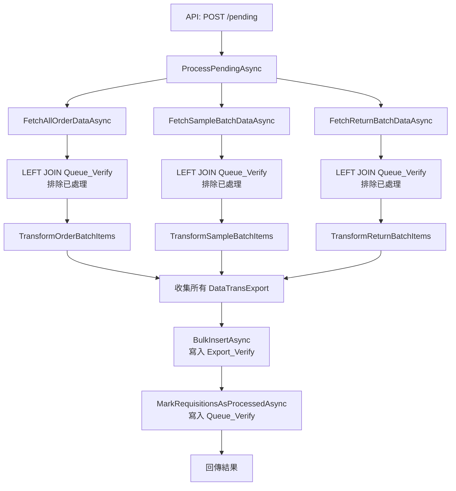

# 資料轉換服務優化 - 完成記錄

## 執行流程



---

## 關鍵改動

### 1. 佇列表追蹤機制
- 新增 `FourPL_DataTrans_Queue_Verify` 表
- 記錄每個已處理的 RequisitionID
- 下次執行自動跳過已處理項目

### 2. SQL 查詢優化
```sql
-- 每個查詢都加入佇列排除
LEFT JOIN [SAPDS_QAS].[dbo].[FourPL_DataTrans_Queue_Verify] Q 
    ON S.RequisitionID = Q.RequisitionID
WHERE ...
  AND Q.RequisitionID IS NULL  -- 排除已處理
```

### 3. API 精簡
| 移除 | 保留 |
|------|------|
| `/TWC1D002` | ❌ |
| `/TWC0D003` | ❌ |
| `/TWC0D004` | ❌ |
| `/process` | ❌ |
| `/pending` | ✅ |

---

## 檔案變更摘要

| 檔案 | 變更 |
|------|------|
| `DataTransformController.cs` | 132 → 40 行 |
| `IDataTransformService.cs` | 49 → 17 行 |
| `DataTransformService.cs` | 2019 → ~1750 行 |
| `CreateQueueVerifyTable.sql` | 新增 |

---

## 使用前準備

### 1. 建立佇列表
在 SAPDS_QAS 執行：
```sql
-- Scripts/CreateQueueVerifyTable.sql
```

### 2. 呼叫 API
```http
POST /api/DataTransform/pending?startDate=2025-11-01
```

### 3. 驗證結果
```sql
-- 檢查匯出資料
SELECT COUNT(*) FROM [dbo].[FourPL_DataTrans_Export_Verify]

-- 檢查佇列記錄
SELECT * FROM [dbo].[FourPL_DataTrans_Queue_Verify]
```
